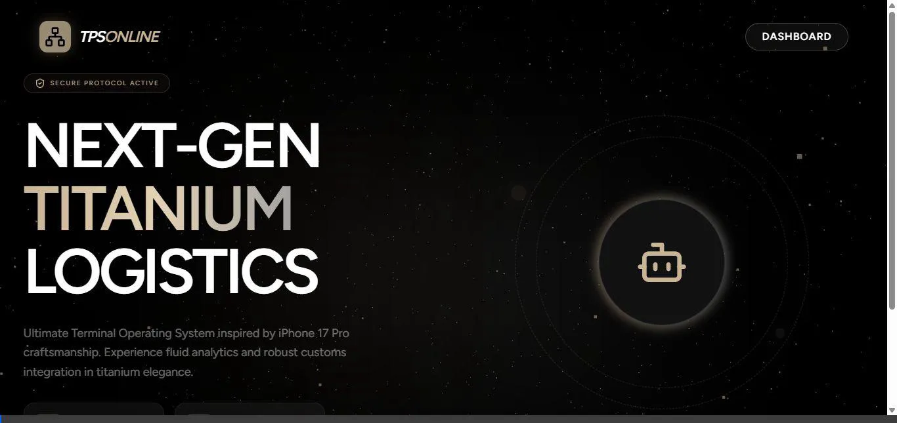

# Rekaman Demo UI TPS Online

Berikut adalah kumpulan simulasi *walkthrough* fitur-fitur pada TPS Online yang siap Anda presentasikan atau bagikan ke YouTube!

## 1. Flow Navigasi & Pengisian Dokumen
Demonstrasi untuk penjelajahan layar Dashboard, fitur otomatisasi pengisian *dummy* data, dan eksplorasi tab pada form Dokumen.

---

## 2. Fitur Export XML & JSON
Demonstrasi fungsionalitas tombol **Preview XML** dan **Preview JSON** langsung dari antarmuka Detail Dokumen.

> **Catatan Tambahan:**
> Apabila animasi presentasi (WebP) di atas berputar terlalu cepat, Anda dapat membukanya melalui peramban (seperti Chrome/Edge), atau memasukannya ke dalam *software video editor* untuk diperhalus/diperlambat kecepatannya sebelum benar-benar diunggah ke YouTube.
